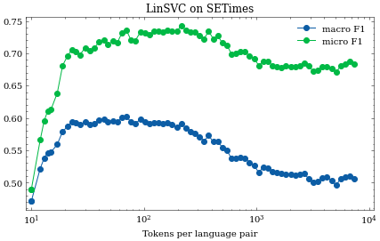

# PLAN

```latex

\subsection{With feature selection}

Feature selection dataset - web data (as was used until now)

Training dataset - web data (as was used until now)

Hyperparameter selection dataset - train split

Evaluation dataset - dev+test split, log micro- macro-F1 and Confusion Matrices

\subsection{Without feature selection}

Approaches
- 3-6 char ngrams (sklearn, countvectorizer)
- fastText
- maybe Transformers

Training dataset - web data (as is used above, if feasible, otherwise, we will use a subset)

Hyperparameter selection dataset - train split (if needed)

Evaluation dataset - dev+test split,  log micro- macro-F1 and Confusion Matrices

```

# First part: With feature selection

## Methodology
In this part I optimize parameter `N`, meaning that I repeatedly generate `N` best tokens, generate a boolean tokenizer with it and train a Linear SVC on web data. The resulting classifier is evaluated on the train split of Twitter and SETimes dataset.

For SETimes I get the following profile:




# Second part: Without feature selection

## Methodology:
In order to not introduce too much bias into the comparison, the classifiers in this part shall be trained on the same data as in part 1. CountVectorizer shall be setup using options `lowercase=True`, but `binary=False`. The hyperparameter optimization is a moot point here, since we do not scan the `N` space.

## Remarks

In case the tokenizer generation fails (due to the feature space being too big), we shall have to resort to limiting the number of max tokens to most frequent ones, where perhaps it would make sense to do it incrementally and again check if perhaps some intermediate value doesn't improve the classifier performance.

One noteworthy observation is that the training now takes significantly longer than before. Since I had problems with memory errors due to too big a vectorizer, I opted for increasing max_features parameter gradually, similarly to what was done in Part 1.
