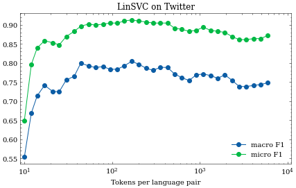

# PLAN

```latex

\subsection{With feature selection}

Feature selection dataset - web data (as was used until now)

Training dataset - web data (as was used until now)

Hyperparameter selection dataset - train split

Evaluation dataset - dev+test split, log micro- macro-F1 and Confusion Matrices

\subsection{Without feature selection}

Approaches
- 3-6 char ngrams (sklearn, countvectorizer)
- fastText
- maybe Transformers

Training dataset - web data (as is used above, if feasible, otherwise, we will use a subset)

Hyperparameter selection dataset - train split (if needed)

Evaluation dataset - dev+test split,  log micro- macro-F1 and Confusion Matrices

```

# First part: With feature selection

## Methodology
In this part I optimize parameter `N`, meaning that I repeatedly generate `N` best tokens, generate a boolean tokenizer with it and train a Linear SVC on web data. The resulting classifier is evaluated on the train split of Twitter and SETimes dataset.

For SETimes I get the following profile:


For Twitter the profile is somewhat similar: 



# Second part: Without feature selection

## Methodology:
In order to not introduce too much bias into the comparison, the classifiers in this part shall be trained on the same data as in part 1. CountVectorizer shall be setup using options `lowercase=True`, but `binary=False`. The hyperparameter optimization is a moot point here, since we do not scan the `N` space.

## Remarks

~~In case the tokenizer generation fails (due to the feature space being too big), we shall have to resort to limiting the number of max tokens to most frequent ones, where perhaps it would make sense to do it incrementally and again check if perhaps some intermediate value doesn't improve the classifier performance.~~ This turned to be a real obstacle. My remediation is described below.

Since I had problems with memory errors due to too big a vectorizer, I opted for increasing max_features parameter gradually, similarly to what was done in Part 1. This took entirely too long, so I scrapped this approach and went with a fixed limit of ~~1e5.~~ Didn't work, after 21min the training hangs. Repeating with smaller number of tokens.

Perhaps this would also be an interesting point to add to the paper, the speed-up of the feature selection approach in comparison to the surface based algorithms.


In the middle of the night I got the only result that would run; at measly 20k tokens the tokenizer fits in memory, but the results on dev split are abysmal; macro and micro F1 are 0.18 and 0.23 respectively. The full results are as follows:

|     N |  macroF1 |  microF1 | accuracy | cm                     | dev       |
|------:|---------:|---------:|---------:|:-----------------------|:----------|
| 19306 | 0.179935 | 0.230269 | 0.230269 | [[ 556  512 1297  191] | SET train |
|       |          |          |          | [ 748  345 1200  263]  |           |
|       |          |          |          | [ 705  233  797  527]  |           |
|       |          |          |          | [   0    0    0    0]] |           |
| 10000 | 0.187787 | 0.206672 | 0.206672 | [[ 388  402  765 1001] | SET train |
|       |          |          |          | [ 371  459  760  966]  |           |
|       |          |          |          | [ 298  522  677  765]  |           |
|       |          |          |          | [   0    0    0    0]] |           |

With these limitations in mind I opted for a scan in N={20k, 50k, 100k} and used the time to prepare fasttext implementation.

Fasttext was set to use 3-6 Char-N-grams and the number of epochs was raised first to 20, producing shit results (all predictions were Montenegrin). Increasing the number of epochs to 50 did nothing.

Issues to discuss with Nikola:
* Linear SVC on character N-grams gets stuck due to the tokenizer being too big. The option here is to limit number of N-grams to O(15k), and still the training is long (last run: >100min for 10k), results are not good.
* Fasttext is slow (50 epochs takes 30 minutes) and results are all Montenegrin. This means the autotuning will likely also take quite a while.
* We can guess that any training with transformers will likely be even more difficult and therefore unusable for practical purposes.

Meeting notes:
* Prompting?
* Go radical: really small number of features. Maybe fix ngram lengths to only a specific length. Nikola suggests 4. Keep CountVectorizer binary=False
* Redo fasttext exps. Remove minn and maxn, set minCount=5

# Addendum 2022-02-01T13:30:56

## SVM + CountVectorizer:

~~no news, stay tuned. Preliminary results hint it won't be revolutionary.~~

It is as suspected. The two best results are far lower than alternatives.

|     N |   macroF1 |   microF1 |   accuracy | cm                      | dev       |
|------:|----------:|----------:|-----------:|:------------------------|:----------|
|  5000 | 0.223974  | 0.304177  |  0.304177  | [[ 634  434 1307  181]  | SET train |
|       |           |           |            |  [ 671  382 1321  182]  |           |
|       |           |           |            |  [ 636  219 1227  180]  |           |
|       |           |           |            |  [   0    0    0    0]] |           |
| 10000 |  0.179591 |  0.347844 |   0.347844 | [[2259  138  143   16]  | SET train |
|       |           |           |            |  [2182  139  213   22]  |           |
|       |           |           |            |  [1957  129  167    9]  |           |
|       |           |           |            |  [   0    0    0    0]] |           |

The setup used: 3-grams only, 
## Fasttext developments

Let me tell you about the massive bug I discovered that would be the star of any entomology collection: I prepared the fasttext formatted files badly and did not separate the instances with new lines, meaning that effectively we were training on only one instance. Once I realised that, I retrained with `minCount=5` and `epoch=10`, the training was fast (40s) and I can deliver the following stellar results:
```
'eval dataset': 'SETimes', 
'macroF1': 0.505, 
'microF1': 0.697,
'accuracy': 0.697,
'cm': [[ 533, 2015,    0,    8],
       [   2, 2392,    5,  157],
       [   0,    6, 2218,   38],
       [   0,    0,    0,    0]]
```

On Twitter dataset I get the following:
```
'eval dataset': 'Twitter',
'macroF1': 0.719, 
'microF1': 0.875, 
'accuracy': 0.875, 
'cm': [[ 47,   6,   0,   0],
       [  4,  37,   1,   3],
       [  2,   3, 229,   2],
       [  2,  23,   0,   9]]
```

* Does reverting to the old setup work better? Train for 10 epochs, only other settings are `minn=3` and `maxn=6`. Turns out it does, but marginally. For SETimes:

```
'eval dataset': 'SETimes', 
'macroF1': 0.529, 
'microF1': 0.718, 
'accuracy': 0.718, 
'cm': [[ 694, 1856,    0,    6],
       [   4, 2368,    0,  184],
       [   0,    0, 2238,   24],
       [   0,    0,    0,    0]]
```

and for Twitter:

```
'eval dataset': 'Twitter', 
'macroF1': 0.726, 
'microF1': 0.883, 
'accuracy': 0.883, 
'cm': [[ 47,   4,   0,   2],
       [  3,  34,   0,   8],
       [  0,   2, 234,   0],
       [  1,  21,   2,  10]]
```

* Does increasing the number of epochs in this better setup help? I set `epoch=50` and shall repeat the training and evaluation. No, the metrics are significantly worse this time (SETimes: macro 0.42, micro 0.62, Twitter: macro 0.62, micro 0.79). Performance at 20 epochs is slighly worse than at 10. I managed to find a marginally better sweetspot at 15 epochs:

```
'eval dataset': 'SETimes', 
'macroF1': 0.576, 
'microF1': 0.764, 
'accuracy': 0.764, 
'cm': [[1040, 1511,    0,    5],
       [   5, 2361,    1,  189],
       [   0,    1, 2240,   21],
       [   0,    0,    0,    0]]

'eval dataset': 'Twitter', 
'macroF1': 0.730, 
'microF1': 0.880, 
'accuracy': 0.880, 
'cm': [[ 48,   2,   0,   3],
       [  3,  32,   1,   9],
       [  0,   2, 233,   1],
       [  1,  18,   4,  11]]
```